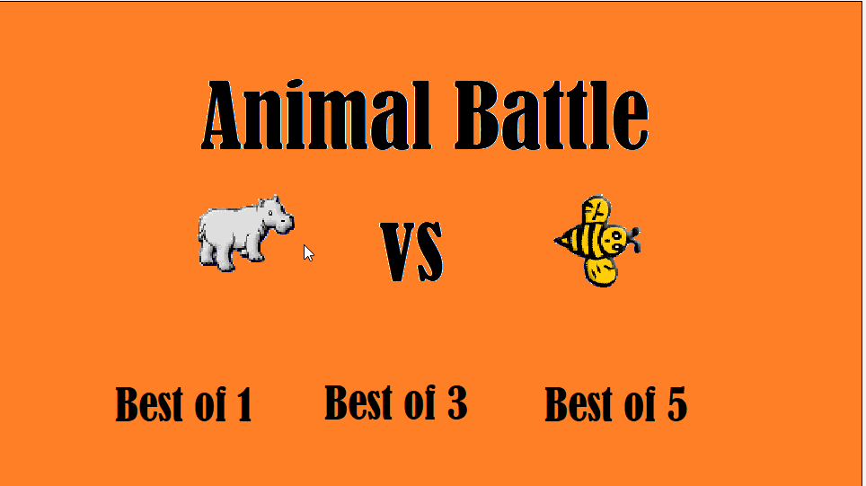
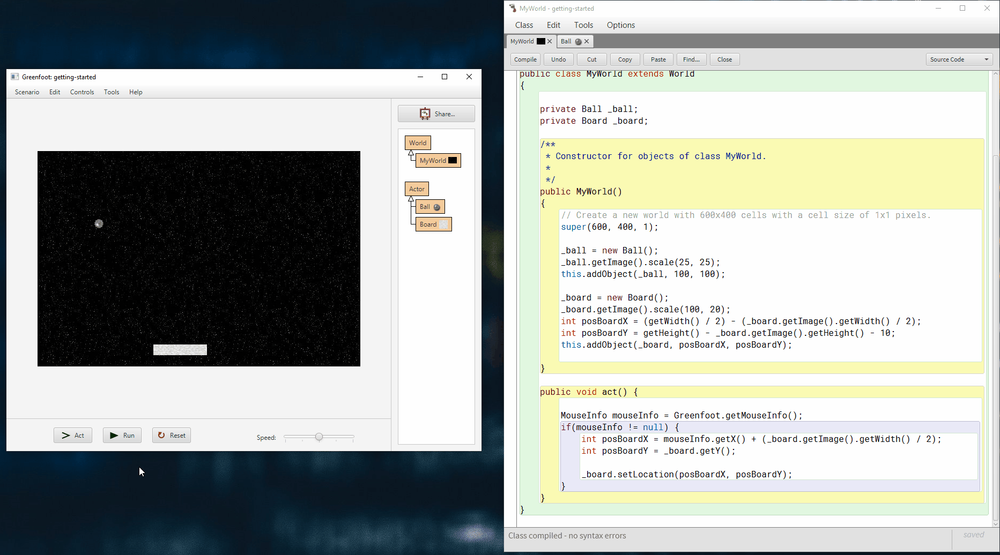

# Greenfoot Projekte

# Material

1. [Installation](https://blogs.kcl.ac.uk/proged/2012/01/03/joc-installation)
1. [Joy of Code](https://www.greenfoot.org/doc/joy-of-code)
1. [YouTube Channel](https://www.youtube.com/user/18km)
1. [Greenfoot API - Beschreibung der Methoden](https://www.greenfoot.org/files/javadoc/)

# Aktuelle Projekte

## Projekt "Animal battle"

* Floarian Röbl
* Christoph Tumfart

Ein Spieler steuert die Biene mit den WASD-Tasten und der andere das Nilpferd mit den Pfeiltasten. Zu Beginn hat jedes Tier 10 "Energie" und bei jedem Feld, das man fährt wird ein Energiepunkt abgezogen. Wenn ein Tier auf eine Erdbeere trifft, bekommt es wieder 4 Energiepunkte dazu. Wenn ein Tier keine Energie mehr hat, kann es nicht mehr weiterfahren. Der Spieler, der zum Schluss die meisten Erdbeeren gefressen hat, gewinnt.

## Projekt "The Castle Story"

* Dominik Ortbauer
* Simon Sixt

In diesem Spiel geht es darum deine Gegner davon abzuhalten deine Burg einzunehmen und dich deiner Habseligkeiten zu berauben.

## Projekt "Getting Started"

* Josef Fürlinger
* Dies ist kleines Demo-Projekt mit Greenfoot um die ersten Schritte mit der IDE zu demonstrieren.

## Projektvorlage "Name 1"

* Schüler 1
* Schüler 2

1. Um was gehts im Projekt in 2-3 Sätzen.
2. Logo zum Projekt
3. GIF zum Projekt erstellen (z.B. [ScreenToGif](https://www.screentogif.com/))
