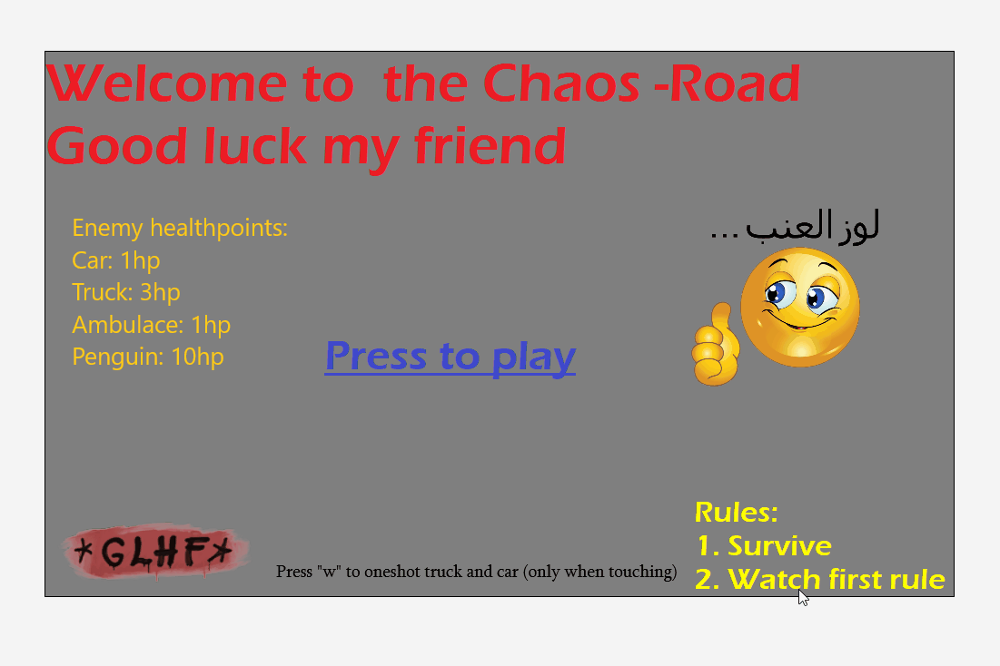
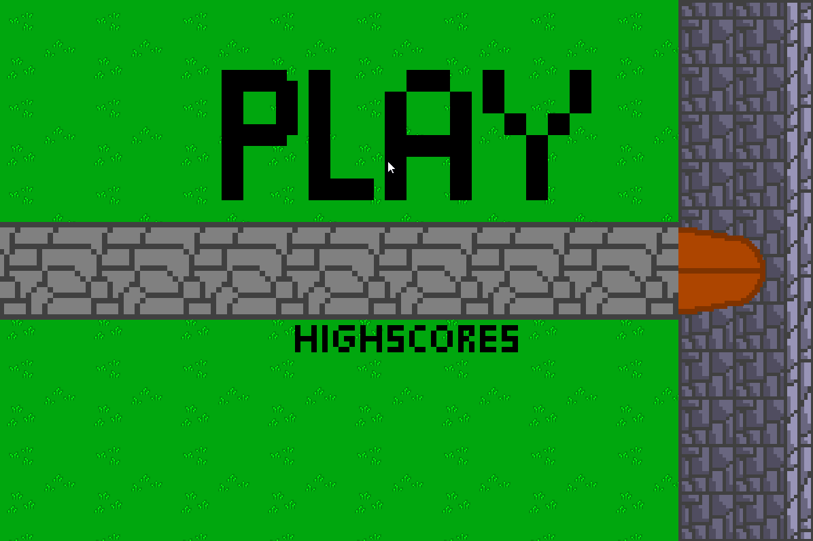
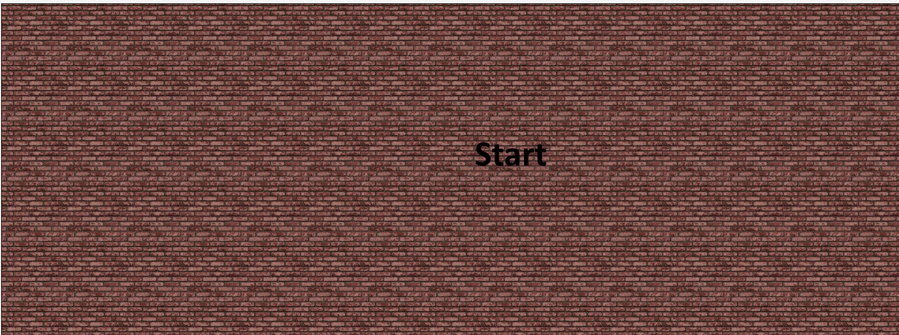

# Greenfoot Projekte

# Material

1. [Installation](https://blogs.kcl.ac.uk/proged/2012/01/03/joc-installation)
1. [Joy of Code](https://www.greenfoot.org/doc/joy-of-code)
1. [YouTube Channel](https://www.youtube.com/user/18km)
1. [Greenfoot API - Beschreibung der Methoden](https://www.greenfoot.org/files/javadoc/)

# Aktuelle Projekte

## Projekt "Chaosroad"

* Jonas Lorenz
* Lukas Trimbacher

Man steuert einen Panzer der durch die Leertaste Kugeln schießt. Man muss die Gegner daran hindern an einem vorbei zu kommen sonst verliert man Leben.
Es gibt verschiedene Gegner: Das Auto ist das schwächste und kann nur eine Kugel wegstecken, während der LKW schon 3 schluckt aber auch langsamer ist.
Der dicke Bowser ist ein "Boss" er stirbt erst nach zehn getroffenen Kugeln ist aber auch sehr langsam. Der Rettungswagen sollte nicht abgeschossen werden, denn er gibt einem wieder Leben sollte er den Panzer passieren, er hält nur eine Kugel aus und kann die Chance auf einen höheren High-Score sein.

In Planung: Wir wollen noch einen halbwegs guten Start und Endbildschirm einfügen, Sounds, Expolsionsanimationen…

### Changelog

* Wir haben  2 neue Actor eingefügt einmal den Bonus Actor welcher ungefähr alle 25 Sekunden kommt, ist dieser auf dem Feld muss man "b" drücken um 50 extra Punkte zu erhalten. Drückt man kein "b"  verschwindet der Actor verliert man keine Leben aber die Chance auf extra Punkte. Der zweite Actor ist die Rakete wegen der man nun auch vor und zurück fahren kann. Sie kommt als einzige von unten und man verliert nur Leben sollte diese einen Berühren, erreicht sie das obere Ende der Straße verliert man keine Leben und man bekommt einen Punkt.
* Wir haben nun Sounds wie ein Schuss- und Explosionsgeräusch, Hintergrundmusik und andere Sounds eingefügt.
* Ebenfalls habe ich einen Score Counter für den Ende des Spiels hinzufügt der einem den gerade erlangten und den Highscore anzeigt.
* Der Highscore wird nur so lange gespeichert bis man da Spiel zurücksetzt.
* Änderung des Design
  * Neuer Hintergrund
  * Mit dem Schlussbild begonnen
* 'Play again'-Taste implementiert
* Krankenwagen eingeführt.

## Projekt "Tank vs. Tank"

* Lawrence Federsel

Man fährt auf einer 2D Welt mit einem Panzer und muss den gegnerischen Panzer treffen. Es ist das Ziel den gegnerischen Panzer zu zerstören. Nach 5 Treffern hat man gewonnen und nach 3 Schüssen muss man nachladen (ca. 1 Sec). Auf dem Feld stehen Hindernisse (Zum Beispiel: ein Haus). Jeder Panzer hat 100 Health Points (HP).

## Projekt "shellShockLive-copy"

* Elias Kramer

Das Spiel ist eine Kopie von ShellShockLive.

Es geht darum andere Panzer abzuschießen und auszuschalten. Man hat einen begrenzten Tank und man kann die Winkel und Kraft, mit der man schießt selbst einstellen.

Geplant sind noch eine Oberfläche, wo die Panzer fahren können und verschiedene Waffen.

## Projekt "Animal battle"

* Florian Röbl
* Christoph Tumfart

Ein Spieler steuert die Biene mit den WASD-Tasten und der andere das Nilpferd mit den Pfeiltasten.
Zu Beginn hat jedes Tier 10 “Energie” und bei jedem Feld, das man fährt wird ein Energiepunkt abgezogen. Wenn ein Tier auf eine Erdbeere trifft, bekommt es wieder 3 Energiepunkte und 3 Scorepunkte dazu, bei einer Banane 5 Energiepunkte und 5 Scorepunkte. Wenn ein Tier keine Energie mehr hat, werden 10 Scorepunkte abgezogen und die Energie wird wieder auf 10 zurückgesetzt, man kann jedoch mit den Scorepunkten nicht in den Minusbereich kommen. Der Spieler, der als Erster 50 Scorepunkte erreicht hat, gewinnt die Runde. Man kann am Anfang des Spiels noch wählen, ob man Best of 1, 3 oder 5 spielen möchte.

### Changelog

* Man kann die Tiere schneller bewegen
* Neuer Hintergrund
* Man bekommt für eine Erdbeere jetzt nur noch 3 Scorepunkte und für eine Banane 5
* Wenn ein Spieler keine Energie mehr hat, wird seine Energie wieder auf 10 zurückgesetzt, er bekommt aber 10 Scorepunkte abgezogen
* Der Erste Spieler, der 50 Scorepunkte erreicht, gewinnt
* Neue Spielende Animation mit Gif
* Der Spielstands-Zahlen vom Übergangsbildschirm haben jetzt keine eigene Klasse
* Der Bildschirm nach einem Spiel (Bee won, Hippo won oder Draw) wurde überarbeitet.
Dieser Bildschirm war davor ein Hintergrund und jetzt ist es eine eigene World – somit verschwinden alle Objekte aus dem Hintergrund.
* Man kann die Tiere schneller bewegen
* Das "Best Of System" funktioniert jetzt – das Spiel endet nach der gewünschten Anzahl an Spielen.
* Bei Spielende wird der Sieger gezeigt.

## Projekt "The Castle Story"

* Dominik Ortbauer
* Simon Sixt

In diesem Spiel geht es darum deine Gegner davon abzuhalten deine Burg einzunehmen und dich deiner Habseligkeiten zu berauben.

### Changelog

* Zwei neue Waffen und einen neuen Gegener hinzugefügt
* Initialimplementierung

## Projekt "Gravity Run"

* Pichl Walter
* Muric Sebastian

Dieses Spiel ist ein ganz normales jump and run game wie man es aus dem Alltag kennt. Auf euch warten 3 herausfordernde Level mit verschiedenen Features. Man kann Gegner abschießen um sich den weg freizuräumen. Spannend wird es auch für dir Controller Spieler, denn man kann dieses Spiel nicht nur mit Maus und Tastatur spielen, sondern wir geben euch auch die Möglichkeit das Spiel mit dem Controller zu spielen. Im Spielordner befindet sich eine README.txt Datei die euch alles erklären wird um sicher ins Spiel zu starten.

## Projekt "Line Jumper"

* Theo Stehrer

Ein Jump and Run Spiel bei dem man Münzen einsammeln muss mit mehreren Leveln.

## Changelog

* Erstes Level und Startbildschirm fertig ohne die Münzen Zweites Level fertig ohne Münzen Victory Screen fertig ohne gutes Design Charakter design abgeschlossen.

## Projekt "Cookie Clicker"

* Lorenz Horvat
* Daniel Höbinger

In Cookie Clicker geht es darum auf den Cookie zu clicken und damit Cookies zu bekommen.

Mit diesen Cookies kann man sich anschließend Upgrades kaufen die dann automatisch Cookies generieren.

## Changelog

* Keine Einträge.

## Projekt "Mini Games"

* Alexander Binder
* Fritz Schernhammer

Im ersten Spiel geht es darum, auf den Charakter zu klicken und somit den Counter zu erhöhen. Mit den Counterpunkten kann man sich dann Hilfsmittel, in diesem Fall eine Oma, kaufen, die nach gewisser Zeit Counterpunkte generieren.

Im zweiten Spiel geht es darum, mit einem Charakter ein Jump ‚n‘ Run zu bewältigen. Wenn man jedoch von einem roten Block getroffen wird, verliert man. Das Spiel hat außerdem mehrere Level.

## Changelog

* Keine Einträge.

## Projektvorlage "Name 1"

* Schüler 1
* Schüler 2

1. Um was gehts im Projekt in 2-3 Sätzen.
2. Logo zum Projekt
3. GIF zum Projekt erstellen (z.B. [ScreenToGif](https://www.screentogif.com/))
