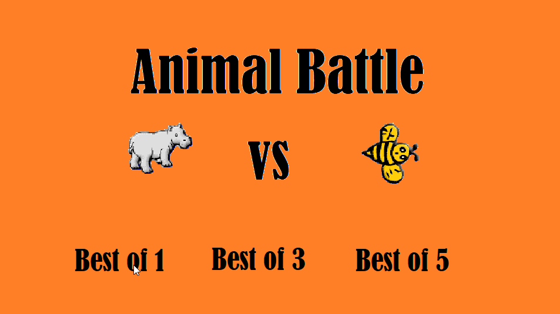

# Greenfoot Projekte

# Material

1. [Installation](https://blogs.kcl.ac.uk/proged/2012/01/03/joc-installation)
1. [Joy of Code](https://www.greenfoot.org/doc/joy-of-code)
1. [YouTube Channel](https://www.youtube.com/user/18km)
1. [Greenfoot API - Beschreibung der Methoden](https://www.greenfoot.org/files/javadoc/)

# Aktuelle Projekte

## Projekt "Chaosroad"

* Jonas Lorenz
* Lukas Trimbacher

Man steuert einen Panzer der durch die Leertaste Kugeln schießt. Man muss die Gegner daran hindern an einem vorbei zu kommen sonst verliert man Leben.
Es gibt verschiedene Gegner: Das Auto ist das schwächste und kann nur eine Kugel wegstecken, während der LKW schon 3 schluckt aber auch langsamer ist.
Der dicke Bowser ist ein "Boss" er stirbt erst nach zehn getroffenen Kugeln ist aber auch sehr langsam. Der Rettungswagen sollte nicht abgeschossen werden, denn er gibt einem wieder Leben sollte er den Panzer passieren, er hält nur eine Kugel aus und kann die Chance auf einen höheren High-Score sein.

In Planung: Wir wollen noch einen halbwegs guten Start und Endbildschirm einfügen, Sounds, Expolsionsanimationen…

### Changelog

* Änderung des Design
  * Neuer Hintergrund
  * Mit dem Schlussbild begonnen
* 'Play again'-Taste implementiert
* Krankenwagen eingeführt.

## Projekt "Tank vs. Tank"

* Lawrence Federsel

Man fährt auf einer 2D Welt mit einem Panzer und muss den gegnerischen Panzer treffen. Es ist das Ziel den gegnerischen Panzer zu zerstören. Nach 5 Treffern hat man gewonnen und nach 3 Schüssen muss man nachladen (ca. 1 Sec). Auf dem Feld stehen Hindernisse (Zum Beispiel: ein Haus). Jeder Panzer hat 100 Health Points (HP).

## Projekt "shellShockLive-copy"

* Elias Kramer

Das Spiel ist eine Kopie von ShellShockLive.

Es geht darum andere Panzer abzuschießen und auszuschalten. Man hat einen begrenzten Tank und man kann die Winkel und Kraft, mit der man schießt selbst einstellen.

Geplant sind noch eine Oberfläche, wo die Panzer fahren können und verschiedene Waffen.

## Projekt "Animal battle"

* Florian Röbl
* Christoph Tumfart

Ein Spieler steuert die Biene mit den `WASD`-Tasten und der andere das Nilpferd mit den Pfeiltasten.
Zu Beginn hat jedes Tier 10 "Energie" und bei jedem Feld, das man fährt wird ein Energiepunkt abgezogen.
Wenn ein Tier auf eine Erdbeere trifft, bekommt es wieder 4 Energiepunkte dazu, bei einer Banane 6 Energiepunkte.
Wenn ein Tier keine Energie mehr hat, kann es nicht mehr weiterfahren.
Für jede gefressene Erdbeere bekommt man einen Punkt und für jede Banane 3 Punkte.
Der Spieler, der zum Schluss die meisten Punkte hat, gewinnt die Runde.
Man kann am Anfang des Spiels noch wählen, ob man Best of 1, 3 oder 5 spielen möchte.

## Projekt "The Castle Story"

* Dominik Ortbauer
* Simon Sixt

In diesem Spiel geht es darum deine Gegner davon abzuhalten deine Burg einzunehmen und dich deiner Habseligkeiten zu berauben.

### Changelog

* Zwei neue Waffen und einen neuen Gegener hinzugefügt
* Initialimplementierung

## Projekt "Gravity Run"

* Sebastian Muric

Im folgenden Spiel geht es darum den goldenen Stern einzusammeln. Doch dafür werden dir viele Gegner in den Weg gestellt, die man entsprechend töten muss um ans Ziel zu gelangen.

## Projektvorlage "Name 1"

* Schüler 1
* Schüler 2

1. Um was gehts im Projekt in 2-3 Sätzen.
2. Logo zum Projekt
3. GIF zum Projekt erstellen (z.B. [ScreenToGif](https://www.screentogif.com/))
